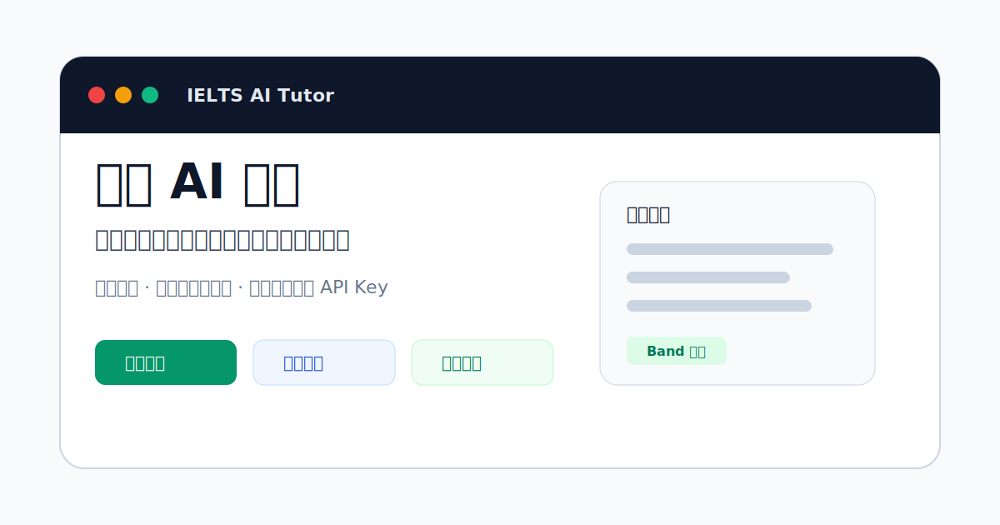

# 雅思 AI 私教：每天帮你制定计划、批改写作、复盘进步

<p align="center">
  
</p>

<p align="center">
  <a href="https://github.com/zx17872762620-blip/ielts-ai-tutor/actions/workflows/ci.yml"></a>
  <a href="LICENSE"></a>
  
  
  
</p>

一个本地运行的 IELTS AI 学习导师桌面应用。它不是题库，也不是官方评分器，而是一个把“每天怎么学、写作怎么改、学完怎么复盘”串起来的个人学习助手。

开源版不内置 API Key、不内置练习内容、不内置学习数据；第一次打开时会先引导用户连接自己的 OpenAI-compatible 大模型接口。

## 适合谁

- 想备考 IELTS，但每天不知道该学什么的人
- 有自己的大模型 API Key，希望用本地工具管理学习节奏的人
- 写作需要持续反馈，而不是只看一次性批改的人
- 想把学习记录、复盘和计划留在本机的人

## 不是什么

- 不是官方 IELTS 产品
- 不是题库软件
- 不提供官方分数保证
- 不内置第三方教材、音频、PDF、OCR 文本或练习内容

## 功能

- 连接用户自己的大模型接口
- 入门画像：目标分数、考试日期、基础、学习方式、导师偏好
- 今日计划：先沟通当天状态，再生成学习任务
- 写作批改：用户粘贴自己的题目和作文，AI 给出反馈
- 每日复盘：按今日任务逐条复盘
- 学习进度：统计任务质量、维度趋势和学习时间
- 周/月报：根据计划、复盘和写作反馈生成总结

## 界面预览

当前开源仓库先提供项目封面图。后续 Release 会补充真实运行截图和便携版下载文件。

## 文档导航

- [中文新手使用攻略](docs/user-guide-zh.md)
- [隐私说明](docs/privacy.md)
- [打包说明](docs/packaging.md)
- [架构说明](docs/architecture.md)
- [Release 发布清单](docs/release-checklist.md)
- [贡献指南](CONTRIBUTING.md)

## 技术栈

- Electron
- Vue 3 + Vite
- TailwindCSS
- FastAPI
- SQLite
- OpenAI-compatible Chat Completions API

## 快速开始

第一次了解这个项目，建议先读：[中文新手使用攻略](docs/user-guide-zh.md)。

### 环境要求

- Windows 10/11
- Node.js 18 或更新版本
- Python 3.10 或更新版本
- 一个兼容 OpenAI Chat Completions 的大模型接口

### 1. 安装前端依赖

```powershell
cd apps\desktop
npm install
```

### 2. 安装后端依赖

```powershell
cd ..\..\backend
python -m venv .venv
.\.venv\Scripts\python.exe -m pip install -r requirements.txt
```

### 3. 配置大模型

可以复制 `.env.example` 为 `.env`，也可以第一次打开应用后在界面里填写。

```text
AI_PROVIDER=openai-compatible
AI_API_KEY=your_api_key_here
AI_BASE_URL=https://api.example.com/v1
AI_MODEL=your-model-name
AI_TIMEOUT_SECONDS=25
AI_MAX_TOKENS=1600
DATABASE_URL=sqlite:///./data/ielts_tutor.sqlite
```

### 4. 启动开发版

从项目根目录运行：

```powershell
powershell -ExecutionPolicy Bypass -File .\scripts\start-app.ps1
```

浏览器开发入口：

```text
http://127.0.0.1:5173
```

后端健康检查：

```text
http://127.0.0.1:8000/api/health
```

## 打包

开源版默认推荐便携版，而不是安装器。便携版更适合 GitHub Release：用户下载后解压/运行，不需要写入系统级安装位置。

```powershell
powershell -ExecutionPolicy Bypass -File .\scripts\package-exe.ps1
```

输出目录：

```text
apps\desktop\dist-electron
```

注意：打包产物不会内置 `.env` 或任何 API Key。用户第一次启动后需要填写自己的大模型连接信息。

## 路线图

- [ ] 补充真实运行截图
- [ ] 发布 Windows 便携版 Release
- [ ] 增加更多模型服务商配置示例
- [ ] 增加导出学习报告功能
- [ ] 增加多语言 README

## 隐私

- 学习数据默认保存在本机 SQLite 数据库。
- API Key 默认只保存在用户本机配置中。
- 项目不包含云端账号系统。
- 使用第三方大模型时，作文、复盘和学习画像会发送给用户配置的模型服务商。

## 版权与免责声明

- 本项目不内置第三方教材、音频、OCR 文本或官方练习内容。
- 用户应只使用自己合法拥有或有权使用的学习材料。
- IELTS 是相关权利方的商标。本项目不是 IELTS 官方产品，也不提供官方评分。

## License

MIT
